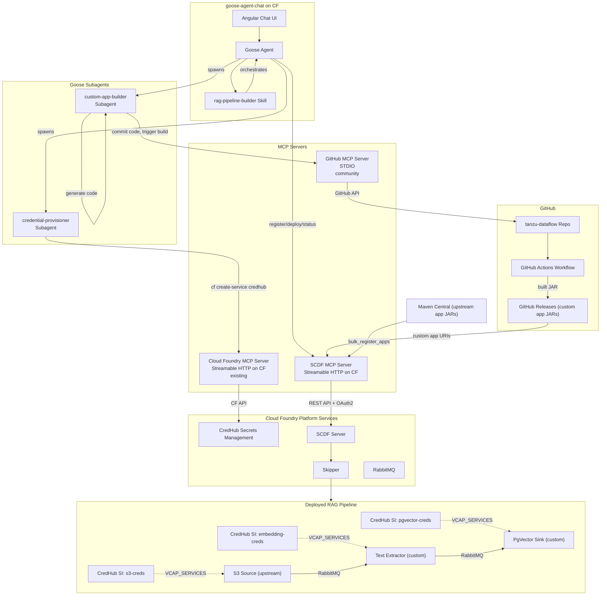

# RAG Ingestion Pipeline Authoring System for Spring Cloud Data Flow

## Overview

Build an AI-powered pipeline authoring system in the `tanzu-dataflow` repo that enables an agent (via [goose-agent-chat](https://github.com/cpage-pivotal/goose-agent-chat)) to design, build, register, and deploy Spring Cloud Stream applications as RAG ingestion pipelines on [Spring Cloud Data Flow for Cloud Foundry](https://techdocs.broadcom.com/us/en/vmware-tanzu/spring/spring-cloud-data-flow-for-cloud-foundry/1-14/scdf-tanzu/index.html).

A user interacts with the Goose agent chat UI and describes a RAG pipeline in natural language (e.g., *"I'd like to monitor an AWS S3 bucket for new files. When they are created, I'd like to ingest the text content into a PgVector database"*). The agent -- guided by the `rag-pipeline-builder` **skill** -- orchestrates the entire pipeline lifecycle by coordinating multiple **MCP servers** (SCDF, Cloud Foundry, GitHub) and delegating discrete tasks to **subagents**.

---

## Design Philosophy

This architecture follows the [Agent Skills](https://agentskills.io/home) separation of concerns between Skills (knowledge/orchestration) and MCP servers (connectivity/tools):

| Layer | Role | Analogy |
|-------|------|---------|
| **Skill** | Orchestration, workflow logic, decision-making, domain expertise | The recipe |
| **MCP Servers** | Focused, composable tool access to external services | The professional kitchen |
| **Subagents** | Isolated execution of discrete, potentially long-running tasks | Sous chefs |
| **Coding Model** | Code generation for custom stream apps (leveraging the chat model's native capability) | The creative chef |

### Key Design Principles

1. **Skills orchestrate, MCP servers execute.** The skill contains the workflow knowledge -- what to do, in what order, and why. MCP servers provide thin, focused access to external services. No "God tools" that do everything in one call.

2. **Fine-grained MCP servers.** Each MCP server has a single responsibility: the SCDF MCP server talks to SCDF, the CF MCP server talks to Cloud Foundry, the GitHub MCP server talks to GitHub. This maximizes composability and reuse.

3. **Reuse existing MCP servers.** The [Cloud Foundry MCP server](https://cf-auth-mcp.apps.tas-ndc.kuhn-labs.com/mcp) (already registered with goose-agent-chat) handles CredHub operations. The [GitHub MCP server](https://github.com/modelcontextprotocol/servers/tree/main/src/github) handles code commits, workflow dispatch, and release queries. We only build what doesn't exist: the SCDF MCP server.

4. **The coding model generates code, not templates.** Custom stream app code is generated by the agent's coding model (guided by skill reference material), not by rigid Mustache templates inside an MCP server. This is more flexible, handles novel requirements, and leverages the model's strongest capability.

5. **Subagents isolate long-running and verbose tasks.** Credential provisioning and custom app builds are delegated to subagents, keeping the main conversation focused on pipeline-level design and user interaction.

---

## Architecture



### Data Flow

1. **User** describes a RAG pipeline in natural language via the goose-agent-chat Angular UI
2. **Skill activates** -- the `rag-pipeline-builder` skill loads its workflow instructions and guides the agent through the orchestration
3. **Agent** (guided by the skill) parses the request, identifies required pipeline components by consulting `references/prebuilt-apps.md`, and determines whether all components are available pre-built or if custom code is needed
4. **Agent** asks the user for any missing credentials, guided by `references/credhub-patterns.md` which specifies what each component requires
5. **Agent spawns `credential-provisioner` subagent** which uses the **Cloud Foundry MCP server** to create CredHub service instances for each component that needs secrets (`cf create-service credhub default ...`)
6. If custom apps are needed: **Agent spawns `custom-app-builder` subagent** which generates Spring Cloud Stream code (using the coding model, guided by `references/custom-app-scaffold.md`), commits it via the **GitHub MCP server**, triggers a GitHub Actions build, polls for completion, and returns the artifact URL
7. **Agent** ensures upstream apps are registered via `bulk_register_apps` (idempotent -- safe to call if already done), then registers any custom RAG apps via `register_app`
8. **Agent** creates the stream definition via the **SCDF MCP server** (`create_stream`)
9. **Agent** deploys the stream with CredHub service bindings and deployer properties via the **SCDF MCP server** (`deploy_stream`), guided by `references/scdf-deployment.md`
10. **Agent** checks deployment status via the **SCDF MCP server** (`get_stream_status`) and reports back to the user
11. The deployed pipeline runs: source polls for data, processors transform it, sink writes embeddings to PgVector. Each app reads its sensitive credentials from `VCAP_SERVICES` at runtime -- no secrets are stored in environment variables or stream definitions

---

## What We Are Building

This project lives entirely in the `tanzu-dataflow` repo and produces:

1. **An SCDF MCP Server** (Spring Boot, Streamable HTTP) deployed to Cloud Foundry -- a focused, thin REST client that calls the SCDF REST API directly (authenticated via OAuth2 client credentials from the p-dataflow service binding) and exposes SCDF operations as MCP tools. This is the **only custom MCP server** we build. CredHub provisioning uses the existing CF MCP server; GitHub operations use the community GitHub MCP server.

2. **Pre-built stream app integration** via the [Spring Cloud Stream Applications](https://github.com/spring-cloud/stream-applications) project (v2025.0.1). The full upstream catalog (~50 apps including S3, HTTP, JDBC, FTP, SFTP, MongoDB, TCP, etc.) is registered with SCDF via bulk import from Maven Central -- no need to build or maintain these. **Custom RAG-specific apps** (text extractor, chunker, embedding processor, PgVector sink) are built as Maven submodules in `stream-apps/` and published to GitHub Releases, since they do not exist upstream

3. **A Goose Skill** (`rag-pipeline-builder`) -- the orchestration brain of the system. It contains the workflow logic, decision trees, credential gathering patterns, and reference material that guide the agent through the entire pipeline lifecycle. Custom app code generation is performed by the agent's coding model, guided by skill reference documents (not rigid templates).

4. **GitHub Actions workflows** for building custom RAG stream apps (CI) and agent-generated custom apps (triggered via the GitHub MCP server)

---

## Project Structure

```
tanzu-dataflow/
├── pom.xml                              # Parent POM (multi-module aggregator)
├── PLAN.md                              # This file
│
├── scdf-mcp-server/                     # SCDF MCP Server module (only custom server)
│   ├── pom.xml                          # spring-ai-starter-mcp-server-webmvc + OAuth2 client
│   ├── manifest.yml                     # CF deployment manifest for SCDF MCP server
│   └── src/main/java/org/tanzu/dataflow/
│       ├── ScdfMcpServerApplication.java
│       ├── scdf/                        # SCDF integration
│       │   ├── ScdfTools.java           # @McpTool methods: bulk_register, register, create, deploy, status
│       │   ├── ScdfService.java         # Calls SCDF REST API directly via RestClient
│       │   ├── ScdfConfig.java          # OAuth2 client credentials + RestClient from p-dataflow binding
│       │   └── SecurityConfig.java      # Permits all inbound requests (MCP server, not a web app)
│       └── model/                       # Domain model (shared records)
│           ├── StreamAppInfo.java       # Record: app name, type, uri, version
│           ├── StreamStatus.java        # Record: stream name, status, description, app statuses
│           └── AppInstanceStatus.java   # Record: instance id, state, attributes
│
├── stream-apps/                         # Custom RAG-specific stream apps (not available upstream)
│   ├── pom.xml                          # Parent POM: Spring Cloud 2025.0.1 + Spring AI 1.1.2 BOMs
│   ├── text-extractor-processor/        # Extracts text from PDF, DOCX, TXT via Apache Tika
│   │   ├── pom.xml
│   │   └── src/main/java/.../textextractor/
│   │       ├── TextExtractorApplication.java
│   │       ├── TextExtractorConfiguration.java   # Function<Message<byte[]>, Message<String>>
│   │       └── TextExtractorProperties.java      # extractor.formats
│   ├── text-chunker-processor/          # Splits text into overlapping chunks
│   │   ├── pom.xml
│   │   └── src/main/java/.../textchunker/
│   │       ├── TextChunkerApplication.java
│   │       ├── TextChunkerConfiguration.java     # Function<Message<String>, List<Message<String>>>
│   │       └── TextChunkerProperties.java        # chunker.size, chunker.overlap, chunker.separator
│   ├── embedding-processor/             # Calls embedding API (OpenAI) via Spring AI
│   │   ├── pom.xml
│   │   └── src/main/java/.../embedding/
│   │       ├── EmbeddingProcessorApplication.java
│   │       ├── EmbeddingConfiguration.java       # Function<Message<String>, Message<float[]>>
│   │       ├── EmbeddingProperties.java          # embedding.model, embedding.dimensions
│   │       └── CredHubEmbeddingConfig.java       # Bridges EMBEDDING_API_KEY → spring.ai.openai.api-key
│   └── pgvector-sink/                   # Writes text to PgVector via Spring AI VectorStore
│       ├── pom.xml
│       └── src/main/java/.../pgvectorsink/
│           ├── PgVectorSinkApplication.java
│           ├── PgVectorSinkConfiguration.java    # Consumer<Message<String>> (VectorStore handles embedding)
│           ├── PgVectorSinkProperties.java       # pgvector.table, dimensions, index-type, distance-type
│           └── CredHubPgVectorConfig.java        # Bridges PGVECTOR_* + EMBEDDING_API_KEY
│
├── .github/workflows/
│   ├── build-stream-apps.yml            # CI for custom RAG apps (build + publish to Releases)
│   └── build-custom-app.yml             # Triggered via workflow_dispatch for agent-generated apps
│
└── skill/                               # Goose skill for goose-agent-chat (Phase 3)
    └── rag-pipeline-builder/
        ├── SKILL.md                     # Orchestration instructions (<500 lines)
        └── references/                  # Progressive disclosure: loaded on demand
            ├── prebuilt-apps.md         # App catalog with config properties and credentials
            ├── custom-app-scaffold.md   # Spring Cloud Stream code patterns for model-based generation
            ├── credhub-patterns.md      # CredHub naming conventions, VCAP_SERVICES parsing
            └── scdf-deployment.md       # SCDF deployer property reference
```

---

## Layer 1: The Skill (Knowledge and Orchestration)

The `rag-pipeline-builder` skill is the **orchestration brain** of the system. Following the [Agent Skills specification](https://agentskills.io/specification) and the patterns from `skills-fundamentals-and-patterns.md`, it employs **Sequential Workflow Orchestration** (Pattern 1) and **Multi-MCP Coordination** (Pattern 2) to guide the agent through a complex, multi-service pipeline lifecycle.

### SKILL.md -- Workflow Instructions

The main `SKILL.md` file (~500 lines) contains:

1. **Intent recognition** -- How to parse natural language pipeline descriptions and identify required components
2. **Component selection logic** -- Decision tree: upstream catalog app vs. custom RAG app vs. agent-generated custom code
3. **Credential gathering workflow** -- What to ask the user, in what order, with clear security guidance
4. **Orchestration steps** -- The ordered sequence of MCP calls across three servers (CF, GitHub, SCDF), including when to spawn subagents
5. **Error handling** -- What to do when builds fail, deployments fail, or credentials are invalid
6. **Examples** -- Common scenarios (S3-to-PgVector, HTTP-to-PgVector) as worked examples

### references/ -- Progressive Disclosure

Detailed reference material is loaded on demand (not at skill activation), keeping the initial context small:

| Reference File | Purpose | When Loaded |
|---|---|---|
| `prebuilt-apps.md` | Complete catalog: upstream Spring Cloud Stream Applications (S3, HTTP, JDBC, etc.) with config property mappings for CredHub, plus custom RAG apps (text-extractor, chunker, embedding, pgvector-sink) | During component identification |
| `custom-app-scaffold.md` | Spring Cloud Stream function model patterns, Maven POM structure, RabbitMQ binder configuration, example source/processor/sink code | When custom app generation is needed |
| `credhub-patterns.md` | CredHub service instance naming conventions, `VCAP_SERVICES` JSON structure, credential resolution patterns in Spring Boot | During credential provisioning |
| `scdf-deployment.md` | SCDF deployer property syntax, CF-specific properties (services, memory, instances), stream definition DSL syntax | During pipeline deployment |

### Why the Skill Orchestrates (Not the MCP Server)

In the previous design, the `create_rag_pipeline` MCP tool was a "God tool" that bundled all orchestration logic. This is wrong for several reasons:

- **Rigidity**: A monolithic tool can't adapt to novel user requests or handle partial failures gracefully
- **Opacity**: The agent can't explain what it's doing or ask clarifying questions mid-workflow
- **Wasted model capability**: The coding model is perfectly suited to making workflow decisions -- embedding those decisions in server-side code wastes this
- **Testing difficulty**: A monolithic tool is hard to test; individual MCP tools called in sequence are easy to test in isolation

With the skill orchestrating, the agent makes each decision visibly, can pause to ask the user questions, can retry failed steps, and can adapt the workflow to unexpected situations.

---

## Layer 2: MCP Servers (Connectivity)

Three MCP servers provide focused, composable tool access. Only one is custom-built.

### SCDF MCP Server (custom -- this project)

A focused Spring Boot MCP server that calls the SCDF REST API directly via an OAuth2-authenticated `RestClient`. This is the **only custom MCP server** we build.

**Why not `DataFlowTemplate`?** The `spring-cloud-dataflow-rest-client` (latest on Maven Central: 2.11.5) was compiled against Spring Framework 5.x. It is binary-incompatible with Spring Boot 3.5.x / Spring Framework 6.x -- specifically, `VndErrorResponseErrorHandler` calls `ClientHttpResponse.getStatusCode()` which returned `HttpStatus` in Spring 5 but returns `HttpStatusCode` in Spring 6. The app crashes on startup. Instead, `ScdfService` calls the SCDF REST API endpoints directly using Spring 6's `RestClient` and parses the HAL+JSON responses with Jackson.

#### Dependencies

Use `spring-ai-starter-mcp-server-webmvc` with `spring.ai.mcp.server.protocol=STREAMABLE`.

**Important:** `spring-ai-starter-mcp-server` (without `-webmvc`) is **STDIO-only** and has no web dependencies. Since we are deploying to Cloud Foundry and need Streamable HTTP transport, we need the `-webmvc` variant. It includes `spring-boot-starter-web` transitively.

Key dependencies in `scdf-mcp-server/pom.xml`:

- `org.springframework.ai:spring-ai-starter-mcp-server-webmvc:1.1.2` -- MCP server with Streamable HTTP support (Spring Boot 3.5.x)
- `org.springframework.boot:spring-boot-starter-oauth2-client` -- OAuth2 client credentials for authenticating to the SCDF server via the p-dataflow service binding
- `org.springframework.boot:spring-boot-starter-actuator` -- Health checks on Cloud Foundry

**Note:** `spring-cloud-dataflow-rest-client` is **not used** due to Spring 5/6 binary incompatibility (see above).

**Annotation package note:** The `@McpTool` and `@McpToolParam` annotations are provided by the `org.springaicommunity:mcp-annotations` transitive dependency. The import is `org.springaicommunity.mcp.annotation.McpTool` (not `org.springframework.ai`).

#### MCP Tools

| Tool | Description | Parameters | Returns |
|------|------------|------------|---------|
| `register_app` | Register a stream app with SCDF by name, type, and artifact URI | `name`, `type` (source/processor/sink), `uri` (HTTP URL or Maven coords) | `StreamAppInfo` |
| `bulk_register_apps` | Import the upstream Spring Cloud Stream Applications catalog (2025.0.1) from Maven Central, registering all ~50 apps (sources, processors, sinks) with SCDF in one call. This is metadata-only -- no JARs are downloaded until a stream is deployed. | none | Summary with count of registered apps |
| `list_registered_apps` | List apps currently registered with SCDF, optionally filtered by type | `type` (optional filter) | `List<StreamAppInfo>` |
| `create_stream` | Create a stream definition using SCDF DSL syntax | `name`, `definition` (DSL string, e.g. `s3 \| text-extractor \| pgvector-sink`), `description` (optional) | `StreamStatus` |
| `deploy_stream` | Deploy a stream with deployer properties (service bindings, memory, instances) | `name`, `properties` (JSON object of deployer properties) | `StreamStatus` |
| `undeploy_stream` | Undeploy a running stream (stops apps but preserves the definition) | `name` | success message |
| `destroy_stream` | Destroy a stream definition (must be undeployed first) | `name` | success message |
| `get_stream_status` | Get the deployment status of a stream and its constituent apps | `name` | `StreamStatus` with per-app instance status |
| `list_streams` | List all stream definitions and their statuses | none | `List<StreamStatus>` |

Example tool definitions (from `ScdfTools.java`):

```java
import org.springaicommunity.mcp.annotation.McpTool;
import org.springaicommunity.mcp.annotation.McpToolParam;

@Component
public class ScdfTools {

    private final ScdfService scdfService;

    ScdfTools(ScdfService scdfService) {
        this.scdfService = scdfService;
    }

    @McpTool(name = "register_app", description = """
            Register a stream app with SCDF. Use type 'source', 'processor', or 'sink'. \
            The uri can be an HTTP URL to a JAR (e.g. a GitHub Release asset) or Maven coordinates.""")
    public StreamAppInfo registerApp(
            @McpToolParam(description = "App name for SCDF registration") String name,
            @McpToolParam(description = "App type: source, processor, or sink") String type,
            @McpToolParam(description = "Artifact URI (HTTP URL or Maven coords)") String uri) {
        return scdfService.registerApp(name, type, uri);
    }

    @McpTool(name = "bulk_register_apps", description = """
            Import the full Spring Cloud Stream Applications catalog (2025.0.1) from Maven Central, \
            registering all ~50 upstream apps (S3, HTTP, JDBC, FTP, SFTP, MongoDB, TCP, etc.) with SCDF. \
            This is metadata-only -- no JARs are downloaded until a stream is deployed. \
            Call this once to make all standard sources, processors, and sinks available.""")
    public String bulkRegisterApps() {
        return scdfService.bulkRegisterApps();
    }

    @McpTool(name = "create_stream", description = """
            Create a stream definition using SCDF DSL syntax. \
            Example definition: 's3 | text-extractor | pgvector-sink'. \
            This creates the definition only; use deploy_stream to deploy it.""")
    public StreamStatus createStream(
            @McpToolParam(description = "Stream name (must be unique)") String name,
            @McpToolParam(description = "Stream definition in SCDF DSL syntax, e.g. 'app1 | app2 | app3'") String definition,
            @McpToolParam(description = "Optional human-readable description of the stream", required = false) String description) {
        return scdfService.createStream(name, definition, description);
    }

    @McpTool(name = "deploy_stream", description = """
            Deploy a stream with deployer properties. Properties should be a JSON object mapping \
            property keys to values. Include CF service bindings \
            (deployer.<app>.cloudfoundry.services), app properties (app.<app>.<key>), \
            and resource limits (deployer.*.memory).""")
    public StreamStatus deployStream(
            @McpToolParam(description = "Stream name to deploy") String name,
            @McpToolParam(description = "Deployer properties as a JSON object, e.g. {\"deployer.*.memory\":\"1024\"}") String properties) {
        return scdfService.deployStream(name, properties);
    }

    @McpTool(name = "get_stream_status", description = """
            Get the deployment status of a stream and its constituent apps. \
            Returns the overall stream status and per-app instance details \
            including state and runtime attributes.""")
    public StreamStatus getStreamStatus(
            @McpToolParam(description = "Name of the stream to check") String name) {
        return scdfService.getStreamStatus(name);
    }
}
```

#### SCDF Integration (RestClient + OAuth2 Service Binding)

The SCDF MCP server authenticates to the SCDF REST API using **OAuth2 client credentials** provided by the Cloud Foundry **p-dataflow service binding**. When the `dataflow` service instance is bound to the app in the manifest, Cloud Foundry injects `VCAP_SERVICES` which Spring Boot automatically flattens into properties:

- `vcap.services.dataflow.credentials.dataflow-url` -- SCDF REST API base URL
- `vcap.services.dataflow.credentials.client-id` -- OAuth2 client ID
- `vcap.services.dataflow.credentials.client-secret` -- OAuth2 client secret
- `vcap.services.dataflow.credentials.access-token-url` -- UAA token endpoint

`ScdfConfig` reads these properties and creates an OAuth2-authenticated `RestClient`:

```java
// ScdfConfig.java -- OAuth2 client credentials from p-dataflow service binding
@Bean
ClientRegistrationRepository clientRegistrationRepository(
        @Value("${vcap.services.dataflow.credentials.client-id}") String clientId,
        @Value("${vcap.services.dataflow.credentials.client-secret}") String clientSecret,
        @Value("${vcap.services.dataflow.credentials.access-token-url}") String tokenUri) {

    ClientRegistration registration = ClientRegistration.withRegistrationId("scdf")
            .clientId(clientId)
            .clientSecret(clientSecret)
            .authorizationGrantType(AuthorizationGrantType.CLIENT_CREDENTIALS)
            .tokenUri(tokenUri)
            .build();

    return new InMemoryClientRegistrationRepository(registration);
}

@Bean
RestClient scdfRestClient(
        @Value("${vcap.services.dataflow.credentials.dataflow-url}") String dataflowUrl,
        OAuth2AuthorizedClientManager authorizedClientManager) {

    var oauth2Interceptor = new OAuth2ClientHttpRequestInterceptor(authorizedClientManager);
    oauth2Interceptor.setClientRegistrationIdResolver(request -> "scdf");

    return RestClient.builder()
            .baseUrl(dataflowUrl)
            .requestInterceptor(oauth2Interceptor)
            .build();
}
```

`ScdfService` calls the SCDF REST API directly and parses HAL+JSON responses:

```java
// ScdfService.java -- register a single app via POST /apps/{type}/{name}
restClient.post()
        .uri("/apps/{type}/{name}", type, name)
        .header("Content-Type", "application/x-www-form-urlencoded")
        .body("uri=" + encodeValue(uri) + "&force=true")
        .retrieve()
        .toBodilessEntity();

// Bulk-register the upstream Spring Cloud Stream Applications catalog (2025.0.1).
// Fetches the RabbitMQ descriptor from Maven Central and parses it as a properties file.
// Each line is "{type}.{name}=https://repo.maven.apache.org/.../{name}-rabbit-5.1.1.jar".
// This is metadata-only -- SCDF stores the URI; no JARs are downloaded until deployment.
private static final String UPSTREAM_DESCRIPTOR_URL =
        "https://repo.maven.apache.org/maven2/org/springframework/cloud/stream/app/" +
        "stream-applications-descriptor/2025.0.1/" +
        "stream-applications-descriptor-2025.0.1.rabbit-apps-maven-repo-url.properties";

public String bulkRegisterApps() {
    String descriptor = RestClient.create().get()
            .uri(UPSTREAM_DESCRIPTOR_URL)
            .retrieve()
            .body(String.class);

    int count = 0;
    for (String line : descriptor.lines().toList()) {
        if (line.isBlank() || line.startsWith("#")) continue;
        // Lines like: source.s3=https://repo.maven.apache.org/.../s3-source-rabbit-5.1.1.jar
        // Skip metadata/bootVersion lines (e.g. source.s3.metadata=..., source.s3.bootVersion=3)
        String[] parts = line.split("=", 2);
        if (parts.length != 2) continue;
        String[] keyParts = parts[0].split("\\.", 2);
        if (keyParts.length != 2 || keyParts[1].contains(".")) continue;

        String type = keyParts[0];   // source, processor, sink
        String name = keyParts[1];   // s3, http, jdbc, ...
        String uri = parts[1].trim();
        registerApp(name, type, uri);
        count++;
    }
    return "Registered %d upstream Spring Cloud Stream Applications (2025.0.1) with SCDF.".formatted(count);
}

// Create a stream definition via POST /streams/definitions
restClient.post()
        .uri("/streams/definitions")
        .header("Content-Type", "application/x-www-form-urlencoded")
        .body("name=" + encodeValue(name) + "&definition=" + encodeValue(definition) + "&deploy=false")
        .retrieve()
        .toBodilessEntity();

// Deploy with properties via POST /streams/deployments/{name}
restClient.post()
        .uri("/streams/deployments/{name}", name)
        .header("Content-Type", "application/json")
        .body(deploymentProperties)
        .retrieve()
        .toBodilessEntity();
```

`SecurityConfig` permits all inbound requests (the MCP server is an API, not a user-facing web app) and provides the `HttpSecurity` bean required by Cloud Foundry's actuator auto-configuration:

```java
@Bean
SecurityFilterChain securityFilterChain(HttpSecurity http) throws Exception {
    return http
            .authorizeHttpRequests(auth -> auth.anyRequest().permitAll())
            .csrf(csrf -> csrf.disable())
            .build();
}
```

### Cloud Foundry MCP Server (existing)

Already registered with goose-agent-chat at `https://cf-auth-mcp.apps.tas-ndc.kuhn-labs.com/mcp`. Handles all Cloud Foundry operations including CredHub service instance management.

The skill instructs the agent (or the `credential-provisioner` subagent) to use this server for:

- `cf create-service credhub default {pipeline}-{app}-creds -c '{...}'` -- Create CredHub service instances
- `cf update-service {instance} -c '{...}'` -- Update credentials
- `cf delete-service {instance}` -- Delete service instances during pipeline teardown
- `cf services` -- List service instances (to verify provisioning)

No custom CredHub code is needed in our project. The CF MCP server already exposes these operations.

### GitHub MCP Server (community)

The [official GitHub MCP server](https://github.com/modelcontextprotocol/servers/tree/main/src/github) provides all GitHub operations needed for the custom app build workflow:

| Capability | GitHub MCP Tool |
|---|---|
| Commit generated code to repo | `create_or_update_file` / `push_files` |
| Trigger build workflow | `create_workflow_dispatch` |
| Poll workflow run status | `list_workflow_runs` / `get_workflow_run` |
| Get release artifact URL | `list_releases` / `get_release` |
| Create repo (if needed) | `create_repository` |

No custom GitHub integration code is needed. Register the GitHub MCP server in goose-agent-chat's config.

---

## Layer 3: Subagents (Isolated Task Execution)

[Goose Subagents](https://block.github.io/goose/docs/guides/subagents/) are independent instances that execute tasks while keeping the main conversation clean. Two natural subagent boundaries emerge in this workflow.

### credential-provisioner Subagent

**Trigger**: Agent spawns this subagent after collecting all credentials from the user.

**Receives**: Pipeline name, list of (appName, credentials) tuples.

**Does**:
1. For each app that needs credentials, calls the CF MCP server to create a CredHub service instance:
   - `cf create-service credhub default {pipeline}-{app}-creds -c '{"KEY":"value",...}'`
2. Verifies each service instance was created successfully
3. Returns the list of service instance names to the parent agent

**Returns**: Map of app names to CredHub service instance names (e.g., `{"s3": "legal-docs-rag-s3-creds", "embedding": "legal-docs-rag-embedding-creds", ...}`).

**Why a subagent**: Credential provisioning involves multiple sequential CF CLI calls that produce verbose output. Isolating this keeps the main conversation focused on pipeline design. The subagent can also handle retries if service creation is slow.

**Extensions**: Only the Cloud Foundry MCP server.

### custom-app-builder Subagent

**Trigger**: Agent spawns this subagent when a pipeline component requires custom code not available in either the upstream Spring Cloud Stream Applications catalog or the custom RAG apps in `stream-apps/`.

**Receives**: App name, type (source/processor/sink), natural language description of the required logic, and any specific dependencies.

**Does**:
1. Reads `references/custom-app-scaffold.md` for Spring Cloud Stream patterns and conventions
2. Generates the complete Spring Cloud Stream application code (main class, configuration, POM, tests) using the coding model's native code generation capability
3. Commits the generated code to `stream-apps-custom/{app-name}/` in the repo via the GitHub MCP server
4. Triggers `.github/workflows/build-custom-app.yml` via `create_workflow_dispatch`
5. Polls workflow run status via `list_workflow_runs` / `get_workflow_run`
6. If the build fails, reads the error logs, fixes the code, recommits, and retriggers (iterative refinement -- Pattern 3 from the skills fundamentals)
7. Once the build succeeds, retrieves the JAR artifact URL from GitHub Releases
8. Returns the artifact URL to the parent agent

**Returns**: Artifact URL for the built custom app (e.g., `https://github.com/.../releases/download/custom-v1/my-processor-1.0.0.jar`).

**Why a subagent**: Custom app generation is a multi-turn process (code generation, build, possible error fixing) that can take several minutes. Isolating it keeps the main conversation clean. The subagent also gets a focused context -- just the code generation task -- which improves code quality.

**Extensions**: GitHub MCP server and developer tools (for code generation).

---

## Layer 4: Code Generation (Model-Native)

Custom stream app code is generated by the agent's coding model, **not** by template expansion. This is a fundamental design choice.

### Why Model-Based Code Generation

| Aspect | Template-Based (Previous) | Model-Based (Current) |
|---|---|---|
| **Flexibility** | Limited to template variables | Handles arbitrary requirements |
| **Novel logic** | Can't handle unanticipated patterns | Adapts naturally |
| **Quality** | Mechanical output | Idiomatic, well-structured code |
| **Maintenance** | Templates must be updated for new Spring versions | Model adapts automatically |
| **Error recovery** | None -- template output is final | Can read build errors and fix code |
| **Context** | No awareness of user intent | Full understanding of what the user needs |

### How It Works

1. The `custom-app-builder` subagent reads `references/custom-app-scaffold.md`, which provides:
   - Spring Cloud Stream function model patterns (`Supplier`, `Function`, `Consumer`)
   - Maven POM structure with required dependencies (Spring Cloud Stream, RabbitMQ binder, Spring Boot parent)
   - Spring Boot configuration patterns for SCDF metadata generation
   - `VCAP_SERVICES` credential resolution patterns
   - Example implementations for each app type

2. The coding model generates a complete Maven project:
   - `pom.xml` with appropriate dependencies
   - Main application class with the Spring Cloud Stream function bean
   - `application.properties` with SCDF metadata and default configuration
   - Unit tests

3. The generated code is committed to the repo and built via GitHub Actions.

4. If the build fails, the subagent reads the build log, identifies the issue, fixes the code, and retries -- something Mustache templates could never do.

---

## CredHub Secrets Management

Sensitive credentials required by pipeline components (AWS keys, database passwords, API keys) are **never passed as stream definition properties or environment variables**. Instead, they are provisioned as [CredHub Secrets Management](https://techdocs.broadcom.com/us/en/vmware-tanzu/platform/credhub-secrets-management/services/credhub/using.html) service instances and bound to the specific Cloud Foundry apps that need them.

### How It Works

1. **Agent collects credentials** from the user (e.g., AWS access key, PgVector password)
2. **Agent spawns `credential-provisioner` subagent** which uses the existing **Cloud Foundry MCP server** to:
   - Create a CredHub service instance per pipeline component: `cf create-service credhub default {pipeline}-{app}-creds -c '{"key":"value",...}'`
   - Example: `cf create-service credhub default legal-docs-rag-s3-creds -c '{"spring.cloud.aws.credentials.access-key":"AKIA...","spring.cloud.aws.credentials.secret-key":"..."}'`
3. **During stream deployment**, the agent includes SCDF deployer properties that bind the CredHub service instances to the corresponding apps:
   ```
   deployer.s3.cloudfoundry.services=legal-docs-rag-s3-creds
   deployer.pgvector-sink.cloudfoundry.services=legal-docs-rag-pgvector-sink-creds
   deployer.embedding.cloudfoundry.services=legal-docs-rag-embedding-creds
   ```
4. **At runtime**, each stream app reads credentials from `VCAP_SERVICES` under the `credhub` key

### CredHub Service Instance Naming Convention

```
{pipeline-name}-{app-name}-creds
```

Examples:
- `legal-docs-rag-s3-creds` -- AWS credentials for the upstream S3 source
- `legal-docs-rag-embedding-creds` -- OpenAI API key for the custom embedding processor
- `legal-docs-rag-pgvector-sink-creds` -- PgVector connection credentials for the custom PgVector sink

### Stream App Credential Resolution

**Upstream apps** use standard Spring Boot externalized configuration. When a CredHub service instance is bound to a CF app, Spring Boot flattens the credentials from `VCAP_SERVICES` into properties. If the CredHub keys match the upstream app's expected property names, no bridging code is needed:

```json
// CredHub service instance "legal-docs-rag-s3-creds" with keys matching Spring Cloud AWS properties:
{
  "spring.cloud.aws.credentials.access-key": "AKIA...",
  "spring.cloud.aws.credentials.secret-key": "...",
  "spring.cloud.aws.region.static": "us-west-2"
}
// Spring Boot flattens these from VCAP_SERVICES, and the upstream S3 source reads them natively.
```

**Custom RAG apps** follow the same pattern -- CredHub keys are named to match the app's `@Value` or `@ConfigurationProperties` bindings:

```java
// In the custom pgvector-sink's configuration
@ConfigurationProperties(prefix = "pgvector")
public record PgVectorProperties(String url, String username, String password, ...) {}
// CredHub keys: "pgvector.url", "pgvector.username", "pgvector.password"
```

### Credential Lifecycle

- **Create**: When a pipeline is created, the `credential-provisioner` subagent provisions CredHub service instances for each component that needs secrets
- **Update**: `cf update-service {instance} -c '{"key":"new-value"}'` followed by `cf restart` of the bound app (agent uses CF MCP server directly)
- **Delete**: When a pipeline is destroyed, the agent uses the CF MCP server to unbind and delete all associated CredHub service instances

### Security Benefits

- Credentials are stored in CredHub's encrypted backend, not in plaintext environment variables
- Credentials are scoped to specific app instances via CF service bindings
- No secrets appear in SCDF stream definitions, deployment manifests, or `cf env` output (only CredHub references)
- Credential rotation is supported via `cf update-service` without redeploying the pipeline

---

## Stream App Strategy

This project uses a **hybrid approach** to stream apps:

1. **Upstream apps** from the [Spring Cloud Stream Applications](https://github.com/spring-cloud/stream-applications) project (v2025.0.1) -- a catalog of ~50 production-ready, configurable source/processor/sink apps published to Maven Central. These are registered with SCDF via `bulk_register_apps` and used directly. We do not build, fork, or wrap them.

2. **Custom RAG-specific apps** built in `stream-apps/` -- components that do not exist in the upstream catalog (text extraction, chunking, embedding, PgVector vector-store writes). These are published to GitHub Releases.

### Why Not Build Our Own S3 Source / HTTP Source?

The upstream apps are battle-tested, well-documented, and actively maintained by the Spring Cloud team. They support Spring Boot 3.4.x, Spring Cloud Stream 4.x, and the RabbitMQ binder. Their configuration properties are externalized via standard Spring Boot mechanisms, which means CredHub credentials injected via `VCAP_SERVICES` work out of the box -- no wrapper code needed.

### Why Not Use the Upstream JDBC Sink for PgVector?

The upstream `jdbc-sink` uses Spring's `SimpleJdbcInsert` with a column-mapping DSL (`jdbc.consumer.columns=name:payload.name`). PostgreSQL's `vector` type requires either the `pgvector-java` library with `PGvector.registerTypes()` or explicit `::vector` SQL casting -- neither of which the upstream JDBC sink supports. More importantly, our PgVector sink uses Spring AI's `VectorStore` abstraction, which manages document metadata, auto-creates the schema with appropriate indexes (HNSW/IVFFlat), and handles the vector type binding correctly. This is fundamentally different from a generic relational INSERT.

---

## Upstream Spring Cloud Stream Applications (v2025.0.1)

Registered with SCDF via the `bulk_register_apps` MCP tool. The full catalog is available at the [stream-applications repository](https://github.com/spring-cloud/stream-applications). Key apps relevant to RAG and data integration pipelines:

| Type | Name | Description | Upstream Artifact |
|------|------|-------------|-------------------|
| source | `s3` | Polls AWS S3 bucket, transfers files to local, emits content | `s3-source-rabbit:5.1.1` |
| source | `http` | Receives HTTP POST payloads and emits as messages | `http-source-rabbit:5.1.1` |
| source | `jdbc` | Polls a database table and emits rows as messages | `jdbc-source-rabbit:5.1.1` |
| source | `file` | Monitors a local directory for new files | `file-source-rabbit:5.1.1` |
| source | `ftp` / `sftp` | Monitors FTP/SFTP servers for new files | `ftp-source-rabbit:5.1.1` |
| source | `mongodb` | Polls a MongoDB collection | `mongodb-source-rabbit:5.1.1` |
| source | `mqtt` | Subscribes to an MQTT topic | `mqtt-source-rabbit:5.1.1` |
| source | `mail` | Polls an email inbox (IMAP) | `mail-source-rabbit:5.1.1` |
| processor | `transform` | Applies SpEL expressions to transform payloads | `transform-processor-rabbit:5.1.1` |
| processor | `filter` | Filters messages based on SpEL expressions | `filter-processor-rabbit:5.1.1` |
| processor | `splitter` | Splits a single message into multiple messages | `splitter-processor-rabbit:5.1.1` |
| processor | `groovy` | Applies Groovy scripts to messages | `groovy-processor-rabbit:5.1.1` |
| processor | `http-request` | Makes HTTP requests and emits responses | `http-request-processor-rabbit:5.1.1` |
| processor | `script` | Executes scripts (JavaScript, Ruby, Python, Groovy) | `script-processor-rabbit:5.1.1` |
| sink | `jdbc` | Inserts payloads into a relational database table | `jdbc-sink-rabbit:5.1.1` |
| sink | `log` | Logs message payloads (useful for debugging pipelines) | `log-sink-rabbit:5.1.1` |
| sink | `mongodb` | Writes to a MongoDB collection | `mongodb-sink-rabbit:5.1.1` |
| sink | `s3` | Writes to an AWS S3 bucket | `s3-sink-rabbit:5.1.1` |
| sink | `elasticsearch` | Writes to Elasticsearch | `elasticsearch-sink-rabbit:5.1.1` |
| sink | `file` | Writes to local files | `file-sink-rabbit:5.1.1` |

All upstream apps are available as JARs from Maven Central at:
```
https://repo.maven.apache.org/maven2/org/springframework/cloud/stream/app/{name}-{binder}/{version}/{name}-{binder}-{version}.jar
```

The complete descriptor (used by `bulk_register_apps`) is at:
```
https://repo.maven.apache.org/maven2/org/springframework/cloud/stream/app/
  stream-applications-descriptor/2025.0.1/
  stream-applications-descriptor-2025.0.1.rabbit-apps-maven-repo-url.properties
```

### Upstream App Configuration for CredHub

Upstream apps use standard Spring Boot externalized configuration. When CredHub service instances are bound via SCDF deployer properties, Spring Boot flattens `VCAP_SERVICES` into properties that the upstream apps read natively:

| Upstream App | CredHub Keys to Provision | Maps to Spring Boot Property |
|---|---|---|
| `s3` (source/sink) | `spring.cloud.aws.credentials.access-key`, `spring.cloud.aws.credentials.secret-key`, `spring.cloud.aws.region.static` | Spring Cloud AWS auto-configuration |
| `jdbc` (source/sink) | `spring.datasource.url`, `spring.datasource.username`, `spring.datasource.password` | Spring Boot DataSource auto-configuration |
| `mongodb` (source/sink) | `spring.data.mongodb.uri` | Spring Boot MongoDB auto-configuration |
| `mqtt` (source/sink) | `mqtt.url`, `mqtt.username`, `mqtt.password` | Spring Integration MQTT properties |
| `mail` (source) | `mail.imap.host`, `mail.imap.username`, `mail.imap.password` | Spring Integration Mail properties |
| `ftp` / `sftp` | `ftp.host`, `ftp.username`, `ftp.password` | Spring Integration FTP/SFTP properties |

**Key insight:** Because CredHub service instance credentials are flattened into Spring Boot properties via `VCAP_SERVICES`, they can be named to match the upstream app's expected property keys directly. No wrapper code or credential-bridging beans are needed.

---

## Custom RAG-Specific Stream App Specifications

These apps do not exist in the upstream catalog and are built as Maven submodules in `stream-apps/`, published to GitHub Releases.

Each app separates configuration into two categories:
- **Stream properties** -- Non-sensitive configuration passed as SCDF stream definition properties (e.g., chunk size, embedding model)
- **CredHub credentials** -- Sensitive values stored in a CredHub service instance and injected via `VCAP_SERVICES` at runtime

### text-extractor-processor

Extracts text content from binary documents (PDF, DOCX, plain text).

- **Function model:** `Function<Message<byte[]>, Message<String>>`
- **Dependencies:** Apache Tika, Spring Cloud Stream, RabbitMQ binder
- **Stream properties (non-sensitive):**
  - `extractor.formats` -- Comma-separated list of supported formats (default: `pdf,docx,txt`)
- **CredHub credentials:** None required

### text-chunker-processor

Splits text into overlapping chunks suitable for embedding.

- **Function model:** `Function<Message<String>, List<Message<String>>>` (one-to-many via collection return)
- **Dependencies:** Spring Cloud Stream, RabbitMQ binder
- **Stream properties (non-sensitive):**
  - `chunker.size` -- Chunk size in characters (default: `1000`)
  - `chunker.overlap` -- Overlap between chunks in characters (default: `200`)
  - `chunker.separator` -- Preferred split boundary (default: `\n\n`)
- **CredHub credentials:** None required

### embedding-processor

Calls an embedding API to convert text chunks into vector embeddings.

- **Function model:** `Function<Message<String>, Message<float[]>>`
- **Dependencies:** Spring AI (`spring-ai-openai`), Spring Cloud Stream, RabbitMQ binder
- **Stream properties (non-sensitive):**
  - `embedding.provider` -- Embedding provider: `openai`, `ollama` (default: `openai`)
  - `embedding.model` -- Model name (default: `text-embedding-3-small`)
  - `embedding.dimensions` -- Output dimensions (default: `1536`)
  - `embedding.base-url` -- Base URL override for the embedding API (optional)
- **CredHub credentials (sensitive):**
  - `EMBEDDING_API_KEY` -- API key for the embedding provider
- **CredHub service instance:** `{pipeline}-embedding-creds`

### pgvector-sink

Writes text documents to a PostgreSQL database with the PgVector extension. Uses Spring AI's `VectorStore` abstraction, which handles both embedding generation and storage in a single operation -- the sink accepts text, not pre-computed embeddings.

- **Function model:** `Consumer<Message<String>>` (VectorStore handles embedding generation internally)
- **Dependencies:** Spring AI PgVector (`spring-ai-starter-vector-store-pgvector`), Spring AI OpenAI (`spring-ai-starter-model-openai`), Spring Cloud Stream, RabbitMQ binder
- **Stream properties (non-sensitive):**
  - `pgvector.table` -- Table name for vector storage (default: `vector_store`)
  - `pgvector.dimensions` -- Vector dimensions (default: `1536`)
  - `pgvector.index-type` -- Index type: `HNSW`, `IVFFLAT`, `NONE` (default: `HNSW`)
  - `pgvector.distance-type` -- Distance metric: `COSINE_DISTANCE`, `EUCLIDEAN_DISTANCE` (default: `COSINE_DISTANCE`)
- **CredHub credentials (sensitive):**
  - `PGVECTOR_URL` -- JDBC URL for the PostgreSQL database
  - `PGVECTOR_USERNAME` -- Database username
  - `PGVECTOR_PASSWORD` -- Database password
  - `EMBEDDING_API_KEY` -- API key for the embedding provider (used by VectorStore)
- **CredHub service instance:** `{pipeline}-pgvector-sink-creds`

**Design note:** Because `VectorStore.add()` in Spring AI 1.1.2 generates embeddings internally (the `Document` class has no `setEmbedding` method), the pgvector-sink accepts text directly rather than pre-computed `float[]` embeddings. This means a typical RAG pipeline can be simplified to `s3 | text-extractor | text-chunker | pgvector-sink` -- the separate `embedding-processor` is not needed in the main pipeline path. The `embedding-processor` remains available for pipelines where embedding generation needs to be decoupled from storage.

---

## GitHub Actions Workflows

### build-stream-apps.yml (CI for custom RAG apps)

Triggered on push to `stream-apps/` or manually. Builds all custom RAG app submodules, runs tests, and publishes JARs as GitHub Release assets.

```yaml
# Key steps:
# 1. Checkout
# 2. Set up JDK 21
# 3. mvn -pl stream-apps -am clean package
# 4. Create/update GitHub Release with JAR artifacts
```

### build-custom-app.yml (Triggered by agent via GitHub MCP)

Triggered via `workflow_dispatch` (by the `custom-app-builder` subagent using the GitHub MCP server's `create_workflow_dispatch` tool) with inputs specifying the custom app directory.

```yaml
# Key steps:
# 1. Checkout (the generated code has already been committed by the subagent)
# 2. Set up JDK 21
# 3. mvn -pl stream-apps-custom/{app-name} clean package
# 4. Upload JAR as GitHub Release asset
# 5. Output the artifact download URL
```

---

## Environment Variables and Configuration

### SCDF MCP Server (application.properties)

```properties
spring.application.name=scdf-mcp-server

# MCP Server configuration (Streamable HTTP transport)
spring.ai.mcp.server.name=scdf-mcp-server
spring.ai.mcp.server.version=1.0.0
spring.ai.mcp.server.protocol=STREAMABLE
spring.ai.mcp.server.type=SYNC
```

**Note:** No SCDF connection properties are needed in `application.properties`. The SCDF URL and OAuth2 credentials are read from `VCAP_SERVICES` (populated by the `dataflow` service binding in the manifest).

### Cloud Foundry Manifest (scdf-mcp-server/manifest.yml)

```yaml
applications:
  - name: scdf-mcp-server
    path: target/scdf-mcp-server-0.0.1-SNAPSHOT.jar
    memory: 1G
    buildpacks:
      - java_buildpack_offline
    services:
      - dataflow
    env:
      JBP_CONFIG_OPEN_JDK_JRE: '{ jre: { version: 21.+ } }'
```

Deploy from the `scdf-mcp-server/` directory: `cd scdf-mcp-server && cf push`.

**Note:** The `dataflow` service binding provides the SCDF URL, OAuth2 client ID/secret, and token URL via `VCAP_SERVICES`. No manual `SCDF_SERVER_URL` environment variable is needed.

### Registration with goose-agent-chat

Add to goose-agent-chat's `.goose-config.yml`:

```yaml
mcpServers:
  - name: cloud-foundry
    type: streamable_http
    url: "https://cf-auth-mcp.apps.tas-ndc.kuhn-labs.com/mcp"
    requiresAuth: true
    clientId: ${CF_MCP_OAUTH_CLIENT_ID}
    clientSecret: ${CF_MCP_OAUTH_CLIENT_SECRET}
    scopes: "openid cloud_controller.read cloud_controller.write"

  - name: scdf
    type: streamable_http
    url: "https://scdf-mcp-server.apps.tas-ndc.kuhn-labs.com/mcp"

  - name: github
    type: stdio
    cmd: npx
    args: ["-y", "@modelcontextprotocol/server-github"]
    env:
      GITHUB_PERSONAL_ACCESS_TOKEN: ${GITHUB_TOKEN}

skills:
  - name: rag-pipeline-builder
    source: https://github.com/<owner>/tanzu-dataflow.git
    branch: main
    path: skill/rag-pipeline-builder
```

---

## Implementation Phases

### Phase 1: Foundation -- SCDF MCP Server ✅

- [x] Set up multi-module Maven project (parent aggregator POM, `scdf-mcp-server/`, `stream-apps/`)
- [x] Configure `scdf-mcp-server/pom.xml` with Spring Boot 3.5.10, `spring-ai-starter-mcp-server-webmvc` 1.1.2, and `spring-boot-starter-oauth2-client`
- [x] Implement `ScdfConfig` (OAuth2 client credentials from p-dataflow service binding + `RestClient`)
- [x] Implement `ScdfService` (calls SCDF REST API directly, parses HAL+JSON responses)
- [x] Implement `SecurityConfig` (permits all inbound requests, satisfies CF actuator auto-configuration)
- [x] Implement `ScdfTools` with `@McpTool`-annotated methods: `register_app`, `list_registered_apps`, `create_stream`, `deploy_stream`, `undeploy_stream`, `destroy_stream`, `get_stream_status`, `list_streams`
- [x] Domain model records: `StreamAppInfo`, `StreamStatus`, `AppInstanceStatus`
- [x] Configure `application.properties` with `spring.ai.mcp.server.protocol=STREAMABLE` and `spring.ai.mcp.server.type=SYNC`
- [x] Create `manifest.yml` for CF deployment with `dataflow` service binding
- [x] Deploy to Cloud Foundry and verify MCP tool discovery
- [x] Verified: MCP `initialize`, `tools/list` (all 8 tools), and tool calls (`list_streams`, `list_registered_apps`) all work end-to-end with OAuth2 authentication against the live SCDF instance

**Lessons learned:**
- `spring-cloud-dataflow-rest-client:2.11.5` is binary-incompatible with Spring Boot 3.5.x / Spring Framework 6.x (`ClientHttpResponse.getStatusCode()` return type changed from `HttpStatus` to `HttpStatusCode`). Replaced with direct REST API calls via `RestClient`.
- The p-dataflow service binding on CF provides OAuth2 credentials (`client-id`, `client-secret`, `access-token-url`) and the `dataflow-url` via `VCAP_SERVICES` -- no manual environment variables needed.
- Spring Security's `HttpSecurity` bean is required by `CloudFoundryActuatorAutoConfiguration` on CF; excluding `SecurityAutoConfiguration` breaks it. A `SecurityConfig` that permits all requests is the correct approach.

### Phase 2: Stream Apps (Upstream Integration + Custom RAG Apps) ✅

- [x] Add `bulk_register_apps` tool to `ScdfTools` and `ScdfService`:
  - Fetches the upstream Spring Cloud Stream Applications 2025.0.1 RabbitMQ descriptor from Maven Central
  - Parses the properties file and registers each app with SCDF via the existing `registerApp` method
  - Metadata-only registration -- no JARs downloaded until stream deployment
- [ ] Redeploy SCDF MCP server to Cloud Foundry with the new `bulk_register_apps` tool
- [x] Create `stream-apps/pom.xml` parent with shared dependency management: Spring Cloud 2025.0.1 BOM, Spring AI 1.1.2 BOM, Spring Cloud Stream + RabbitMQ binder
- [x] Create `stream-apps/` submodules for custom RAG-specific components (not available upstream):
  - `text-extractor-processor` -- `Function<Message<byte[]>, Message<String>>` via Apache Tika 3.2.3
  - `text-chunker-processor` -- `Function<Message<String>, List<Message<String>>>` with configurable size/overlap/separator
  - `embedding-processor` -- `Function<Message<String>, Message<float[]>>` via Spring AI OpenAI EmbeddingModel
  - `pgvector-sink` -- `Consumer<Message<String>>` via Spring AI VectorStore (handles embedding generation internally)
- [x] Each custom app: Spring Boot 3.5.10 + Spring Cloud Stream 4.x (via 2025.0.1 BOM) + RabbitMQ binder
- [x] CredHub credential bridging via `@PostConstruct` config classes (`CredHubEmbeddingConfig`, `CredHubPgVectorConfig`)
- [x] Unit tests for text-extractor and text-chunker; context-load tests for embedding-processor and pgvector-sink
- [x] Create `build-stream-apps.yml` GitHub Actions workflow for CI + publish custom apps to Releases
- [x] Create `build-custom-app.yml` GitHub Actions workflow (triggered via `workflow_dispatch`)
- [x] Move `manifest.yml` from repo root to `scdf-mcp-server/` (it's exclusively for the MCP server)
- [x] Full project compiles: all 7 modules (scdf-mcp-server + stream-apps parent + 4 submodules + root aggregator)

**Lessons learned:**
- Spring AI 1.1.2's `Document` class has no `setEmbedding` method. The `VectorStore.add()` pipeline handles embedding generation internally via a configured `EmbeddingModel`. This means the pgvector-sink accepts text (not pre-computed `float[]`) and lets VectorStore handle the full lifecycle. This simplifies the typical RAG pipeline to `s3 | text-extractor | text-chunker | pgvector-sink` -- no separate embedding-processor needed in the main path.
- The `embedding-processor` is still useful for pipelines where embedding generation is decoupled from storage (e.g., branching pipelines, multi-sink scenarios, or embedding inspection).
- Spring Cloud Stream's function model supports one-to-many via `Function<T, List<R>>` -- `text-chunker-processor` uses this to emit multiple chunk messages from a single input.
- The `spring-ai-starter-model-openai` artifact (not `spring-ai-openai`) is the correct starter for Spring AI 1.1.2 auto-configuration.

### Phase 3: Goose Skill + References

- Author `skill/rag-pipeline-builder/SKILL.md` with workflow orchestration instructions
- Author `references/prebuilt-apps.md` -- complete app catalog
- Author `references/custom-app-scaffold.md` -- Spring Cloud Stream code patterns for model-based generation
- Author `references/credhub-patterns.md` -- CredHub naming conventions and credential resolution
- Author `references/scdf-deployment.md` -- deployer property reference
- Include worked examples for common scenarios (S3 to PgVector, HTTP to PgVector)
- Document subagent delegation patterns and error handling

### Phase 4: Integration and Deployment

- Register SCDF MCP server with goose-agent-chat's `.goose-config.yml`
- Register GitHub MCP server with goose-agent-chat's `.goose-config.yml`
- Register the `rag-pipeline-builder` skill with goose-agent-chat
- End-to-end test: user asks for RAG pipeline via chat UI, skill orchestrates across all three MCP servers with subagent delegation
- Test custom app generation flow: subagent generates code, commits, builds, returns artifact URL
- Test credential provisioning flow: subagent creates CredHub service instances, main agent deploys with bindings

---

## Example End-to-End Scenario

**User says:** *"I'd like to monitor an AWS S3 bucket called 'legal-docs' in us-west-2 for new PDF files. When they are created, extract the text, chunk it, generate embeddings with OpenAI, and store them in my PgVector database."*

**Agent workflow (orchestrated by the skill):**

1. **Skill activates** -- Goose recognizes this as a RAG pipeline request and loads `rag-pipeline-builder`

2. **Component identification** -- Agent reads `references/prebuilt-apps.md` and identifies:
   - Source: `s3` (upstream -- Spring Cloud Stream Applications 2025.0.1)
   - Processors: `text-extractor`, `text-chunker` (custom RAG apps)
   - Sink: `pgvector-sink` (custom RAG app -- handles embedding generation internally via VectorStore)
   - No separate `embedding-processor` needed; no fully custom (agent-generated) apps needed

3. **Credential gathering** -- Agent reads `references/credhub-patterns.md` and asks for:
   - AWS access key, secret key, and region (for upstream `s3` source)
   - OpenAI API key (for `pgvector-sink` -- used by VectorStore's EmbeddingModel)
   - PgVector JDBC URL, username, password (for `pgvector-sink`)

4. **Credential provisioning via subagent** -- Agent spawns `credential-provisioner` subagent:
   - Subagent uses **CF MCP server** to create:
     - `cf create-service credhub default legal-docs-rag-s3-creds -c '{"spring.cloud.aws.credentials.access-key":"AKIA...","spring.cloud.aws.credentials.secret-key":"...","spring.cloud.aws.region.static":"us-west-2"}'`
     - `cf create-service credhub default legal-docs-rag-pgvector-sink-creds -c '{"PGVECTOR_URL":"jdbc:postgresql://...","PGVECTOR_USERNAME":"...","PGVECTOR_PASSWORD":"...","EMBEDDING_API_KEY":"sk-..."}'`
   - Subagent returns: `{"s3": "legal-docs-rag-s3-creds", "pgvector-sink": "legal-docs-rag-pgvector-sink-creds"}`

5. **App registration** -- Agent uses **SCDF MCP server**:
   - `bulk_register_apps()` -- registers the full upstream catalog (S3, HTTP, JDBC, etc.) from Maven Central (idempotent, metadata-only)
   - `register_app(name="text-extractor", type="processor", uri="https://github.com/.../text-extractor-processor-1.0.0.jar")`
   - `register_app(name="text-chunker", type="processor", uri="https://github.com/.../text-chunker-processor-1.0.0.jar")`
   - `register_app(name="pgvector-sink", type="sink", uri="https://github.com/.../pgvector-sink-1.0.0.jar")`

6. **Stream creation** -- Agent uses **SCDF MCP server**:
   - `create_stream(name="legal-docs-rag", definition="s3 | text-extractor | text-chunker | pgvector-sink")`

7. **Stream deployment** -- Agent uses **SCDF MCP server** (guided by `references/scdf-deployment.md`):
   - `deploy_stream(name="legal-docs-rag", properties={...})` with:
     ```
     deployer.s3.cloudfoundry.services=legal-docs-rag-s3-creds
     deployer.pgvector-sink.cloudfoundry.services=legal-docs-rag-pgvector-sink-creds
     app.s3.file.consumer.mode=contents
     app.s3.s3.remote-dir=legal-docs
     deployer.*.memory=1024
     ```

8. **Status check** -- Agent uses **SCDF MCP server**:
   - `get_stream_status(name="legal-docs-rag")` -- confirms all 4 apps are running

9. **Report to user** -- Agent confirms the pipeline is deployed and running, summarizes the components, and provides the SCDF dashboard URL

**Pipeline teardown (when requested):**
1. Agent uses **SCDF MCP server**: `undeploy_stream("legal-docs-rag")`, then `destroy_stream("legal-docs-rag")`
2. Agent uses **CF MCP server**: `cf delete-service legal-docs-rag-s3-creds`, `cf delete-service legal-docs-rag-pgvector-sink-creds`

**Credential rotation:**
- Agent uses **CF MCP server**: `cf update-service legal-docs-rag-s3-creds -c '{"spring.cloud.aws.credentials.access-key":"new-key",...}'`
- Agent uses **CF MCP server**: `cf restart` the bound app (or the agent uses **SCDF MCP server** to undeploy/redeploy the stream)
